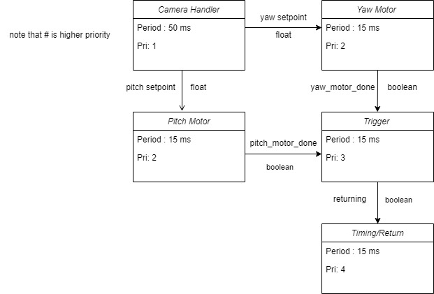
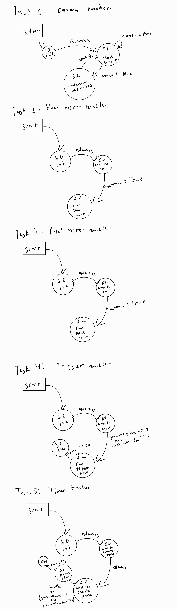

@mainpage

This project implements a heat seeking nerf gun turret for the ME 405 term project.  The hardware includes an stm32 microcontroller, two dc motors with integrated encoders, a DC servo, and many 3d printed parts.  The following files were used to control the project:

main.py - the main file that runs the cooperative multitasking commands for each of the tasks
mlx_cam.py - a script that is used to read camera data off an mlx90640 thermal camera and convert that data to a numpy array
cam2setpoint.py - contains the function that performs computer vision computations on the thermal camera image to generate two set      points for the yaw and pitch of the turret

subdirectory mlx90640 - contains drivers for the mlx90640 camera, created by Dr. John Ridgely

subdirectory motor_drivers - contains the drivers for the motors of the nerf turret.  The subdirectory contains the following files
motor_driver.py - implements a motor driver class to drive an Ametek Pittman motor using PWM
servo_driver.py - implements a servo driver class to drive a purchased servo through PWM
encoder_reader.py - implements a class to read the built in encoders on the Ametek Pittman motor
controller.py - implements a closed loop PID controller to control a generic plant with a generic setpoint, in this cased used by the motor driver and the encoder reader.

To implement the control of the system, cooperative multitasking was used.  Specifically, a cotasking based priority schedule was used to run five tasks that controlled the functions of the turret.  The task diagram can be found below.

Each task required its own finite state machine to control their various states.  The finite state machines for each of the tasks can be found below.

